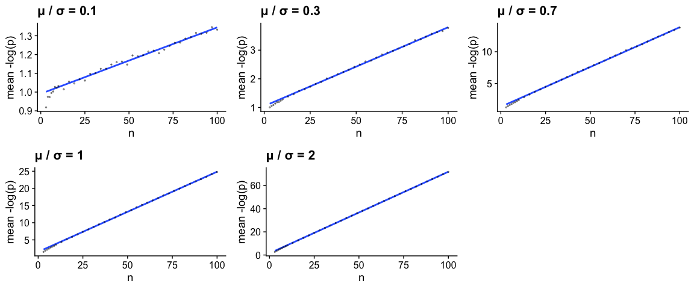

Asymptotics of 𝔼(-log(p)) on n for one-sample two-sided t-test.
================
Frederik Ziebell

``` r
suppressPackageStartupMessages({
  library("furrr")
  library("future")
  library("cowplot")
  library("tidyverse")
})
theme_set(theme_cowplot())

t_test_p <- function(mu_over_sigma, n){
  
  mu <- 1
  sigma <- mu/mu_over_sigma
  x <- rnorm(n, 0, sigma)
  y <- rnorm(n, mu, sigma)
  res <- t.test(x,y)
  
  data.frame(
    mu_over_sigma = mu_over_sigma,
    n = n,
    p = res$p.value
  ) 

}

future::plan("multisession")

n_trials <- 1e4
params <- expand.grid(
  mu_over_sigma = c(0.1,0.3,0.7,1,2),
  n = c(3:9,seq(10,100,3))
)

res <- future_map_dfr(1:nrow(params), function(i){
  map_df(1:n_trials, function(j){
    t_test_p(params$mu_over_sigma[i], params$n[i])
  })
}, .progress = T, .options = furrr_options(seed = T))

map(unique(res$mu_over_sigma), function(mos){
  res %>% 
    filter(mu_over_sigma == mos) %>%
    mutate(neg_log_p = -log(p)) %>% 
    group_by(n) %>% 
    summarize(mean_neg_log_p = mean(neg_log_p), .groups = "drop") %>% 
    ggplot(aes(n, mean_neg_log_p)) +
      geom_smooth(method = "lm", formula = "y ~ x", mapping = aes(weight = n), se = F) +
      geom_point(size = rel(.5), alpha = .4) +
      labs(y = "mean -log(p)", title = str_c("μ / σ = ", mos))
}) %>% 
  plot_grid(plotlist=., ncol = 3)
```

<!-- -->
